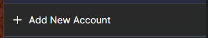
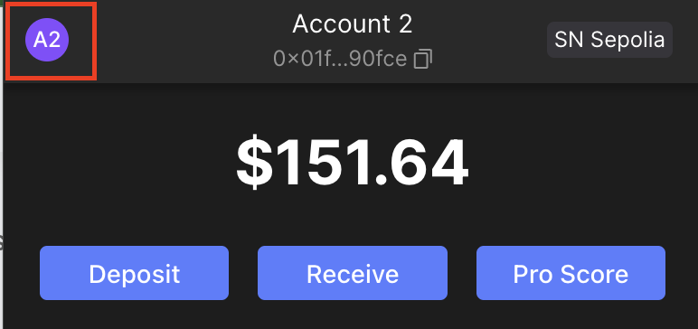
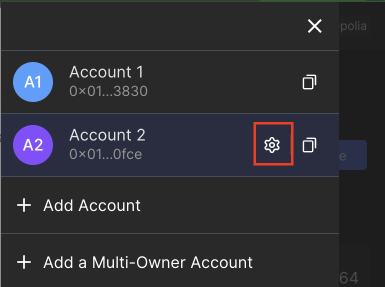
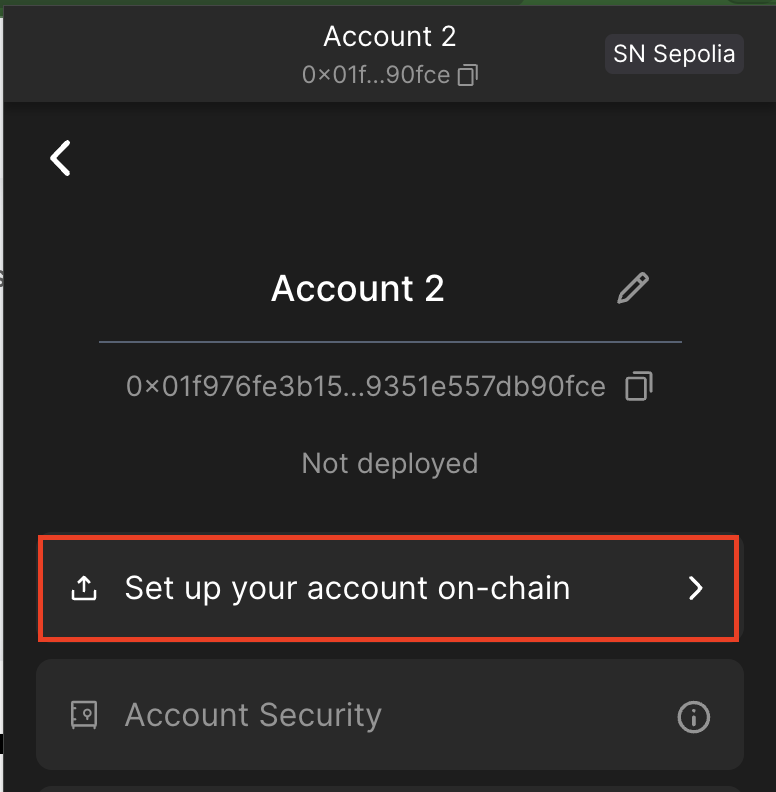

# Cairo Crash Course

## Starknet Foundry Exercise 3

### Part 1 - Importing Braavos Account into Starknet Foundry
1. Create an account on Sepolia testnet in Braavos wallet
   <br>
   

2. Prefund with ETH, here are some faucet options:
   - [Starknet Faucet](https://starknet-faucet.vercel.app/)
   - [Blast API Faucet](https://blastapi.io/faucets/starknet-sepolia-eth)
   - [Alchemy - Faucet](https://www.alchemy.com/faucets/starknet-sepolia)

3. In Braavos, go to the account settings and click "Set up your account on-chain"
   <br>
   
   <br>
   
   <br>
   
   <div style="page-break-after: always;"></div>

4. Export the private key, public key, and address.

5. To add the Braavos account to sncast run:

```bash
sncast --url "https://starknet-sepolia.public.blastapi.io/rpc/v0_6" \
   account add \
   --name <chosen_account_name> \
   --address <account_address> \
   --private-key <account_private_key> \
   --public-key <account_public_key> \
   --add-profile <chosen_account_name> \
```

For more details:
[Starknet Foundry: Importing an Account](https://foundry-rs.github.io/starknet-foundry/starknet/account.html#importing-an-account).

[Starknet Foundry: account add](https://foundry-rs.github.io/starknet-foundry/appendix/sncast/account/add.html).

After adding the account a new `snfoundry.toml` file should be created in the project root folder, as well as `starknet_open_zeppelin_accounts.json` file should be created in your `~/.starknet_accounts/` folder.

6. Add the new profile to the `Scarb.toml` file, follow the instructions [here](https://foundry-rs.github.io/starknet-foundry/projects/configuration.html#sncast).

### Part 2 - Deploying and interacting with a contract
**For the following assignments, write the command that you used for each one**

1. Using the imported account, declare a class of contract `ValueContract`, which is implemented in the file `starknet_foundry_1/value_contract.cairo` (from the previous exercise).

```bash

```

2. Deploy a contract with the new class hash

```bash

```

3. Set a value to 5 by calling the `add_value()` function

```bash

```

4. Read a value and check that the invoking of the function worked.

```bash

```

Great! You successfully deployed your first contract, and interacted with it! :)

### Useful Links
[Foundry Book: Dive into sncast](https://book.starknet.io/ch02-05-foundry-cast.html#dive-into-sncast)